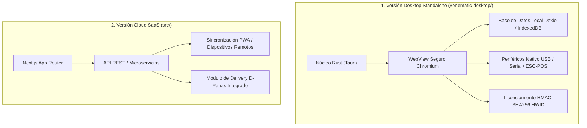
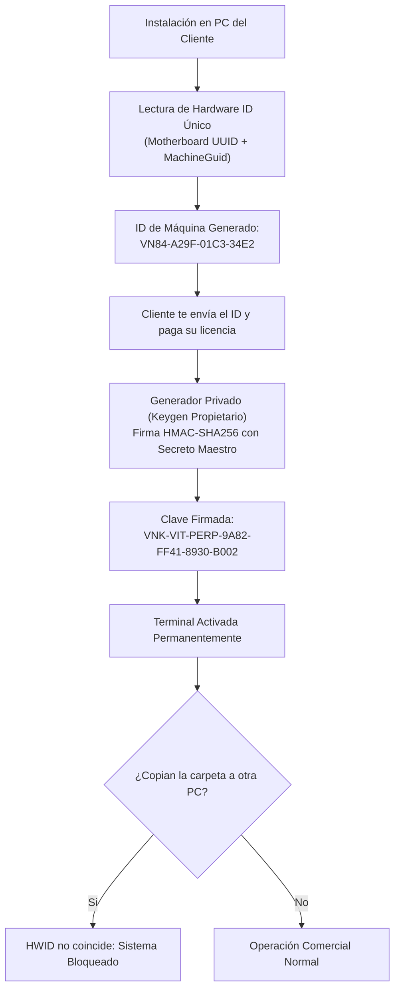

# 🛒 Venematic POS Enterprise v2.0
> **Terminal de Punto de Venta & Distribución Comercial de Alto Rendimiento**  
> *Arquitectura Híbrida: Standalone Nativo Offline (Tauri / Rust) & SaaS Cloud (Next.js)*

[](https://github.com/aivyntrax-cpu/venematic)
[](https://github.com/aivyntrax-cpu/venematic)
[-amber.svg?style=for-the-badge&logo=cashapp)](https://github.com/aivyntrax-cpu/venematic)
[](https://github.com/aivyntrax-cpu/venematic)

---

## 📑 Tabla de Contenidos
1. [Visión General del Sistema](#-visión-general-del-sistema)
2. [Informe Técnico y Auditoría de Mercado (Venezuela vs Internacional)](#-informe-técnico-y-auditoría-de-mercado)
3. [Arquitectura de las Dos Versiones](#-arquitectura-de-las-dos-versiones)
4. [Módulos y Bondades Funcionales](#-módulos-y-bondades-funcionales)
5. [Módulo de Balanzas y Pesables (Cálculo y Flujo)](#-módulo-de-balanzas-y-pesables)
6. [Terminal Móvil & Escáner Wi-Fi Sin Permisos](#-terminal-móvil--escáner-wi-fi-sin-permisos)
7. [Sistema Anti-Piratería y Licenciamiento Offline](#-sistema-anti-piratería-y-licenciamiento-offline)
8. [Los 6 Rubros Comerciales Preconfigurados](#-los-6-rubros-comerciales-preconfigurados)
9. [Diseño Visual y Alto Contraste Industrial](#-diseño-visual-y-alto-contraste-industrial)
10. [Instalación, Compilación y Puesta en Marcha](#-instalación-compilación-y-puesta-en-marcha)

---

## 🎯 Visión General del Sistema

**Venematic POS** es una solución tecnológica integral de facturación rápida, control de inventario multimoneda y distribución comercial diseñada para operar sin fricciones en entornos de alta rotación minorista (retail, minimarkets, charcuterías, panaderías, bodegones, farmacias y ferreterías).

A diferencia de los sistemas de facturación tradicionales diseñados hace décadas, Venematic resuelve nativamente las particularidades del comercio moderno y la economía bimonetaria venezolana: **liquidación automática de tasa oficial BCV, cobros divididos multimoneda (efectivo USD + Pago Móvil), lectura inteligente de etiquetas de balanza con peso incrustado, catálogo fotográfico con eliminación automática de fondo por IA/Canvas local, y terminal móvil sincronizada por red local sin depender de internet**.

---

## 📊 Informe Técnico y Auditoría de Mercado

### 1. Comparativa frente a los Monopolios del Mercado Venezolano

En Venezuela, el software administrativo ha estado dominado históricamente por cuatro soluciones: **Saint Enterprise**, **A2 Softway**, **Valery Software** y **Profit Plus**.

```
                        MATRIZ DE COMPETITIVIDAD EN VENEZUELA
                        
   Velocidad / UX / Móvil   ▲
                            │                                     ★ VENEMATIC POS
                            │                         (Bimoneda nativa, Escaneo Móvil,
                            │                          Diseño moderno, Balanza táctil)
                            │
                            │         LOYVERSE
                            │
                            │
   Tradicional / Burocrático│   SAINT / A2 / VALERY
                            │   (Monopolio SENIAT fiscal,
                            │    pesados, lentos, interfaz Windows 98)
                            └────────────────────────────────────────►
                             Cumplimiento Fiscal Estricto (SENIAT / Impresoras)
```

| Factor Crítico | Saint Enterprise POS | A2 Softway | Valery Software | Venematic POS v2.0 |
| :--- | :--- | :--- | :--- | :--- |
| **Tiempo de Arranque / Venta** | Lento (30-60 segs, SQL Server/DBF) | Medio (15-30 segs) | Medio (20 segs) | **Instantáneo (1 segundo)** |
| **Manejo Bimonetario (BCV/USD)** | Parcheado sobre moneda local | Parcheado manual | Parcheado manual | **Nativo en el núcleo del ledger** |
| **Terminal Móvil de Inventario** | Requiere colectores Honeywell (\$300+) | No disponible nativo | No disponible nativo | **Cualquier Android/iPhone vía QR local** |
| **Cálculo de Balanza Manual** | Requiere teclado numérico rígido | Configuración engorrosa | Básico | **Display digital LCD con botones rápidos** |
| **Interfaz y Ergonomía** | Windows 98/XP gris pesado | Anticuada | Clásica de formularios | **Moderno, alto contraste industrial y temas** |
| **Soporte Impresoras Fiscales** | Homologado The Factory / Bixolon | Homologado amplio | Homologado | **Tickets térmicos ESC/POS 58/80mm** *(ver nota)* |

> [!WARNING]
> **Punto Crítico de Negocio:** El 100% de la ventaja de Saint y A2 en medianos/grandes supermercados radica en los drivers de impresoras fiscales homologadas por el SENIAT. Venematic cubre de forma perfecta y superior el segmento masivo de pequeños y medianos comercios, bodegones, franquicias simplificadas y notas de entrega. Para competir en hipermercados formales, se debe incorporar el driver fiscal para cajas registradoras de The Factory HKA / Dascom.

---

### 2. Comparativa frente a Plataformas Internacionales

| Plataforma | Fortaleza | Por qué NO se adapta a la realidad comercial venezolana |
| :--- | :--- | :--- |
| **Square POS / Clover** | Excelencia en diseño y pasarelas de pago con tarjeta EMV/NFC en USA/Europa. | **Incompatible.** Exigen conexión permanente a internet, bancos norteamericanos, no soportan la tasa fluctuante del BCV, ni admiten pagos en efectivo fragmentado o Pago Móvil. |
| **Loyverse POS** | Popular en tablets a nivel mundial por su plan base gratuito. | **Deficiente en multimoneda.** No realiza cálculo dinámico de vuelto en Bolívares vs Dólares, obliga a conexión a internet para sincronizar inventarios complejos y cobra suscripciones mensuales en dólares por funciones avanzadas. |
| **Toast POS** | El estándar para restaurantes en Estados Unidos. | **Nicho cerrado y costoso.** Hardware propietario obligatorio y sin adaptación fiscal o cambiaria para Latinoamérica. |
| **Odoo POS** | Gran robustez en ERP general. | **Extremadamente pesado y costoso de implantar.** Requiere servidores dedicados en Python/PostgreSQL y consultores especializados. |

---

## 🏗️ Arquitectura de las Dos Versiones

Venematic se distribuye en dos sabores arquitectónicos para cubrir todo el espectro de clientes:



### 1. Versión Desktop Standalone (`venematic-desktop/`)
* **Público Objetivo:** Comercios independientes, puntos de venta físicos en mostrador, bodegas, charcuterías y tiendas de conveniencia.
* **Tecnología:** Tauri (Rust) + Next.js App Router + Dexie.js (IndexedDB local transaccional).
* **Independencia Total:** No requiere internet ni servidor externo. Si la luz o la fibra se cortan, el cajero sigue cobrando, pesando y emitiendo tickets.

### 2. Versión Cloud / SaaS (`src/`)
* **Público Objetivo:** Franquicias, cadenas multitienda y comercios con delivery hub.
* **Tecnología:** Next.js Fullstack, Progressive Web App (PWA), Service Workers y módulo delivery para marketplace.

---

## ⚡ Módulos y Bondades Funcionales

```
┌─────────────────────────────────────────────────────────────────────────────────┐
│                           SUITE INTEGRAL VENEMATIC POS                          │
├───────────────────────┬─────────────────────────┬───────────────────────────────┤
│   PUNTO DE VENTA      │  INVENTARIO & BALANZA   │   ADMINISTRACIÓN & SEGURIDAD  │
├───────────────────────┼─────────────────────────┼───────────────────────────────┤
│ • Cobro bimoneda F1   │ • Catálogo visual F2    │ • Configuración F8            │
│ • Vuelto dual USD/Bs  │ • Pesables (/kg, /gr)   │ • Roles Cajero / Admin        │
│ • Pago Móvil / Zelle  │ • Código balanzas EAN13 │ • Bloqueo de pantalla (Ctrl+L)│
│ • Gaveta de dinero F10│ • Mermas / Kardex       │ • Auditoría de turnos         │
│ • Venta a Crédito     │ • Escáner móvil QR local│ • Licenciamiento HWID         │
└───────────────────────┴─────────────────────────┴───────────────────────────────┘
```

### 1. Punto de Venta Dinámico (POS - F1)
* **Cobro Multimoneda Instantáneo:** Registro de cuentas con desglose simultáneo en USD y Bolívares calculados al instante con la tasa oficial BCV.
* **Liquidación Dividida de Pagos:** El cliente puede pagar, por ejemplo, \$10 en efectivo billete y el restante en Pago Móvil o tarjeta de débito en Bolívares.
* **Calculadora de Vueltos:** Evita errores del operador mostrando exactamente cuánto regresar en divisas o en bolívares al tipo de cambio exacto.
* **Apertura Eléctrica de Gaveta de Dinero (F10):** Pulso binario ESC/POS estándar enviado automáticamente al finalizar cobros en efectivo o manual con la tecla rápida **`F10`**.
* **Gestión de Ventas a Crédito / Fiado:** Módulo integrado para asignar consumos a clientes autorizados, validando límite de crédito disponible y registrando abonos parciales.

### 2. Inventario Profesional y Auditoría de Mermas (F2)
* **Kardex Justificado:** Cada ajuste de inventario exige tipificación formal: *Merma/Rotura*, *Caducidad*, *Autoconsumo*, *Devolución a Proveedor* o *Conteo Físico*.
* **Historial Inmutable:** Registro auditado de cada movimiento con fecha, cantidad, usuario responsable y motivo.
* **Soporte Decimal Exacto:** Admite fracciones precisas de peso (ej. `15.450 kg` de queso blanco llanero).

---

## ⚖️ Módulo de Balanzas y Pesables

El sistema liquida productos de peso variable en tres modalidades blindadas:

### 1. Balanza Digital de Mostrador (Sin cable / Tradicional)
Para comercios que tienen balanzas electrónicas convencionales en el mostrador:
* Al pulsar sobre cualquier producto pesable o presionar el botón **"Fijar Peso"** en la barra superior, se abre la ventana LCD digital.
* El cajero introduce los gramos (ej. `450 g`) o kilogramos (`0.450 kg`).
* Cuenta con botones táctiles de 1 clic para pesos habituales: **`100g`**, **`250g`**, **`500g`**, **`1 kg`**.
* **Fórmula en Vivo en Pantalla:**
  $$\text{Total USD} = \text{Peso en Kilos} \times \text{Precio por Kilo fijado en Inventario}$$
  *(Ejemplo: $0.450\text{ kg} \times \$6.50\text{ USD/kg} = \$2.93\text{ USD} \rightarrow \text{Convertido a Bs automáticamente al BCV}$)*.

### 2. Balanzas con Emisión de Tickets de Código de Barras (Torrey, Toledo, Dibal, Systel)
* Al escanear el ticket impreso en charcutería o carnicería (códigos GS1 / EAN-13 con prefijos estándar `20`, `21`, `22` o `24`):
* El motor [`scale-barcode.ts`](file:///c:/Users/pcpro/OneDrive/Documents/venematic-master/venematic-master/venematic-desktop/src/lib/hardware/scale-barcode.ts) descompone el código:
  `[Prefijo 20] + [PLU Producto 4-5 dígitos] + [Peso en Gramos 5 dígitos] + [Dígito Verificador]`.
* Localiza el producto en inventario, calcula el valor por el peso extraído y añade el producto al carrito sin intervención del cajero.

### 3. Balanzas Conectadas por Puerto USB / Serial
* Comunicación continua mediante el estándar WebSerial / RS-232, capturando el peso vivo de la bandeja en tiempo real.

---

## 📱 Terminal Móvil & Escáner Wi-Fi Sin Permisos

Convierte cualquier teléfono inteligente (Android / iOS) en una terminal de inventario, escáner de códigos y cámara fotográfica para el catálogo de productos:

* **Vinculación Inmediata con Código QR:** El cajero o encargado escanea con su celular el código QR generado en pantalla.
* **Sin Requiere Certificados HTTPS ni Permisos Invasivos:** Utiliza el mecanismo nativo `<input type="file" capture="environment">` procesado por el motor `Html5Qrcode`. Funciona sobre cualquier red Wi-Fi local HTTP sin que el navegador bloquee el acceso a la cámara.
* **Procesador Fotográfico con Eliminación de Fondo (AI / Canvas 2D Local):** Al tomar la foto de un producto en el estante, el algoritmo limpia automáticamente el fondo y lo monta en un lienzo blanco limpio para catálogo profesional, sin enviar fotos a servidores externos ni consumir tokens de pago.

---

## 🔒 Sistema Anti-Piratería y Licenciamiento Offline

Diseñado para proteger tu propiedad intelectual al comercializar instaladores locales ejecutables en computadores de clientes:



### Características del Motor Criptográfico:
1. **Atado al Hardware Físico (Machine-Locked):** La clave es matemáticamente inválida en cualquier otra computadora distinta a la que generó el HWID.
2. **Tres Modalidades de Licencia:**
   * **Vitalicia / Perpetua (`VIT`):** Activación permanente para 1 computadora física sin fecha de vencimiento.
   * **Suscripción Anual (`ANL`):** Validez por 365 días para contratos de soporte y actualización periódica.
   * **Demostración (`DMO`):** Activación temporal por 15 días para pruebas comerciales.
3. **Detector de Alteración de Reloj (*Anti-Tamper Clock*):** Compara la hora del sistema con la última transacción registrada en la base de datos para impedir que el cliente atrase la fecha de Windows para engañar la vigencia de la licencia.
4. **Keygen Privado Incluido:** Accesible desde la pestaña oculta en **Configuración (F8) ➔ Licenciamiento y HWID** para que generes las llaves de tus clientes en segundos.

---

## 🏪 Los 6 Rubros Comerciales Preconfigurados

Venematic incluye perfiles de negocio preestablecidos con paletas visuales y catálogos de productos muestra con códigos de barra y precios reales del mercado venezolano:

1. 📚 **Librería & Papelería:** Tema Índigo & Slate. Cuadernos, lápices Mongol, resmas de papel carta/oficio, bolígrafos BIC, tijeras, carpetas y marcadores.
2. 💊 **Farmacia & Salud:** Tema Turquesa & Verde Menta. Analgésicos, alcohol antiséptico, sueros orales, apósitos, vitaminas y termómetros.
3. 🏪 **Bodega Tradicional:** Tema Ámbar & Dorado Cálido. Harina PAN, arroz, pasta, aceite comestible, queso blanco llanero, café molido y víveres esenciales.
4. 🥖 **Panadería & Pastelería:** Tema Horno & Canela Dorado. Pan canilla, pan campesino, cachitos de jamón, café con leche, croissants y pasteles.
5. 🍷 **Licorería & Bodegón:** Tema Reserva & Uva Imperial. Cervezas, rones venezolanos (Santa Teresa, Diplomático), whisky, licores secos y snacks.
6. 🛒 **Supermercado / Market:** Tema Azul Océano Dinámico. Carnicería pesable, pollo entero, lácteos, embutidos, detergentes y artículos de higiene.

*Opciones de Aplicación:* En Configuración puedes elegir entre **Reemplazar Catálogo Completo**, **Combinar con Catálogo Existente** o **Solo Aplicar Tema y Colores**.

---

## 🎨 Diseño Visual y Alto Contraste Industrial

* **Modo Alto Contraste Industrial:** Superficies sólidas, bordes reforzados de 1px nítidos, tipografía con números tabulares (`JetBrains Mono`) y cero difuminados que saturen pantallas táctiles o monitores LCD convencionales.
* **10 Paletas de Marca:** Azul Océano, Turquesa Fresco, Índigo Ejecutivo, Esmeralda Neón, Violeta Uva, Ámbar Dorado, Escarlata Intenso, Magenta Neón, Cian Eléctrico y Carbón Slate.
* **Contraste 100% Accesible:** Textos oscuros profundos sobre fondos claros e inversión luminosa sobre fondos oscuros garantizados.

---

## 🚀 Instalación, Compilación y Puesta en Marcha

### Requisitos de Entorno
* **Node.js**: v18.x o v20.x LTS
* **Rust & Cargo** *(Solo para compilar la versión de escritorio nativa con Tauri)*: v1.70+
* **Gestor de Paquetes**: `npm` o `yarn`

### 1. Ejecutar en Modo Desarrollo (Versión Desktop Local)
```powershell
# Clonar repositorio
git clone https://github.com/aivyntrax-cpu/venematic.git
cd venematic/venematic-desktop

# Instalar dependencias
npm install

# Iniciar servidor local interactivo (Puerto 3002)
npm run dev
```
Acceder en el navegador o emulador local a `http://localhost:3002`.

### 2. Generar el Instalador Autoejecutable de Windows (`.exe`)
Para compilar la versión de escritorio nativa y generar el instalador de distribución:
```powershell
cd venematic-desktop

# Construir el bundle de producción
npm run build

# Compilar ejecutable nativo de Windows con Tauri
cargo tauri build
```
El instalador final se generará en la ruta:
`venematic-desktop/src-tauri/target/release/bundle/msi/` o `dist-installer/Venematic-POS-Setup-v2.0.0.exe`.

---

## 📄 Créditos y Licencia

* **Desarrollador / Propietario:** Aivyntrax
* **Repositorio Oficial:** [github.com/aivyntrax-cpu/venematic](https://github.com/aivyntrax-cpu/venematic)
* **Licencia de Distribución:** Comercial Propietaria con Bloqueo Criptográfico HWID. Queda prohibida la redistribución o copia no autorizada del código fuente sin autorización expresa del autor.
