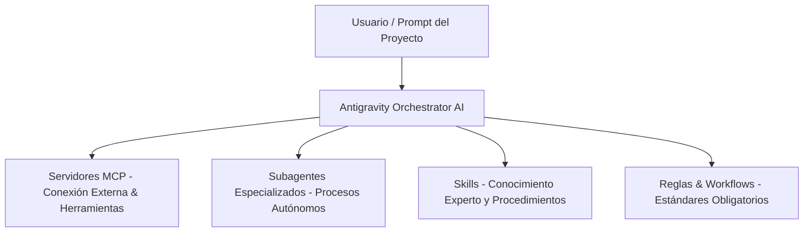

# 🤖 Guía Maestra e Informe Integral: Agentes, Servidores MCP y Skills

> **Ámbito**: Sistema de Inteligencia y Capacidades Agenticas de Antigravity  
> **Fecha de Actualización**: Septiembre 2026  
> **Propósito**: Mapeo exhaustivo de todas las herramientas, agentes y skills disponibles en el entorno de desarrollo, con instrucciones detalladas para replicar y utilizar este arsenal en **cualquier proyecto futuro**.

---

## 📑 Índice General
1. [Arquitectura de Capacidades en Antigravity](#1-arquitectura-de-capacidades-en-antigravity)
2. [Servidores MCP (Model Context Protocol) Conectados](#2-servidores-mcp-conectados)
3. [Agentes y Subagentes Especializados](#3-agentes-y-subagentes-especializados)
4. [Catálogo Maestro de Skills por Dominio](#4-catálogo-maestro-de-skills-por-dominio)
   - 4.1. [Especialistas de Negocio y Arquitectura POS (Venematic Agency)](#41-especialistas-de-negocio-y-arquitectura-pos-venematic-agency)
   - 4.2. [Diseño de Interfaz, Animación y UX Pro-Elite](#42-diseño-de-interfaz-animación-y-ux-pro-elite)
   - 4.3. [Ingeniería Pragmática y Anti-Bloat (Suite Ponytail)](#43-ingeniería-pragmática-y-anti-bloat-suite-ponytail)
   - 4.4. [Grafos de Conocimiento y Arquitectura de Código (Graphify)](#44-grafos-de-conocimiento-y-arquitectura-de-código-graphify)
   - 4.5. [Inteligencia Artificial Generativa y Gemini API](#45-inteligencia-artificial-generativa-y-gemini-api)
   - 4.6. [Desarrollo Móvil y Multiplataforma (Android, Flutter, Dart, Swift)](#46-desarrollo-móvil-y-multiplataforma-android-flutter-dart-swift)
   - 4.7. [Cloud, Backend Serverless y Datos (Firebase & GCP)](#47-cloud-backend-serverless-y-datos-firebase--gcp)
   - 4.8. [Geolocalización, Extensiones y Mantenimiento](#48-geolocalización-extensiones-y-mantenimiento)
5. [Guía Paso a Paso para Usar este Sistema en Proyectos Futuros](#5-guía-paso-a-paso-para-usar-este-sistema-en-proyectos-futuros)
   - 5.1. [Estructura de Directorios Estándar](#51-estructura-de-directorios-estándar)
   - 5.2. [Formato y Anatomía de un archivo SKILL.md](#52-formato-y-anatomía-de-un-archivo-skillmd)
   - 5.3. [Creación de Reglas de Comportamiento (.agents/rules/)](#53-creación-de-reglas-de-comportamiento-agentsrules)
   - 5.4. [Creación de Flujos Guiados (.agents/workflows/)](#54-creación-de-flujos-guiados-agentsworkflows)
   - 5.5. [Configuración de Servidores MCP (mcp_config.json)](#55-configuración-de-servidores-mcp-mcp_configjson)
6. [Matriz Práctica: Qué Skill o Agente Activar Según el Proyecto](#6-matriz-práctica-qué-skill-o-agente-activar-según-el-proyecto)

---

## 1. 🏛️ Arquitectura de Capacidades en Antigravity

El sistema de asistencia inteligente de Antigravity opera bajo una jerarquía modular de 4 capas:



1. **Servidores MCP**: Protocolos de conexión estandarizados para controlar navegadores reales, Flutter, bases de datos o documentación oficial.
2. **Subagentes**: Procesos autónomos con contexto aislado para ejecutar tareas de navegación visual o auditorías complejas.
3. **Skills**: Carpetas de directivas empaquetadas (`SKILL.md`) que dotan al modelo de un conocimiento especializado profundo que trasciende el entrenamiento general.
4. **Reglas y Workflows**: Instrucciones mandatorias fijas (`.agents/rules/`) o comandos interactivos (`.agents/workflows/`).

---

## 2. 🔌 Servidores MCP Conectados

Los servidores MCP están disponibles en el entorno local (`~/.gemini/antigravity-ide/mcp/`) y pueden ser utilizados bajo demanda:

| Servidor MCP | Carga | Herramientas Clave | Para Qué Sirve en Cualquier Proyecto |
|---|---|---|---|
| **`playwright`** | Lazy | `browser_navigate`, `browser_click`, `browser_fill_form`, `browser_type`, `browser_take_screenshot`, `browser_snapshot`, `browser_network_requests`, `browser_console_messages` | Automatización de navegador real sin emulación sintética. Ideal para pruebas E2E, verificación visual de UI, scraping avanzado y validación de flujos de checkout/login. |
| **`gemini-api-docs`** | Eager | `gemini_search_docs`, `gemini_get_doc` | Búsqueda y lectura en tiempo real de la documentación oficial y actualizada de los SDKs de Google Gemini (Python, Node/TS, Go, Java, .NET). Evita código obsoleto. |
| **`dart-mcp-server`** | Lazy | `analyze_files`, `hot_reload`, `hot_restart`, `widget_inspector`, `flutter_driver_command`, `lsp`, `pub_dev_search` | Control profundo del entorno Flutter/Dart. Permite inspeccionar el árbol de widgets en vivo, ejecutar Hot Reload programático y analizar código estáticamente. |
| **`data-agent-kit`** | Lazy | `get_active_editor_context`, `get_active_gcp_connection`, `read_resource`, `list_resource_templates` | Inspección de conexiones activas a Google Cloud y contexto de bases de datos para proyectos orientados a backend y analítica. |
| **`notebooks`** | Lazy | `create_notebook`, `insert_code_cell`, `insert_markdown_cell`, `get_cell_outputs`, `search_cells` | Creación y ejecución programática de notebooks Jupyter `.ipynb` para pipelines de ciencia de datos, exploración de datasets o reportes periódicos. |
| **`visualization`** | Lazy | `render_chart` | Renderizado directo de gráficos estadísticos (barras, líneas, dispersión) directamente en el entorno de desarrollo. |

---

## 3. 👥 Agentes y Subagentes Especializados

| Agente | Tipo | Capacidades | Cuándo Usarlo en Proyectos Futuros |
|---|---|---|---|
| **`browser_subagent`** | Subagente Autónomo | Navega páginas web, hace clic, completa formularios, captura pantallas y graba sesiones en video WebP guardadas en los artefactos del sistema. | Siempre que necesites que la IA audite visualmente un sitio web, pruebe un flujo interactivo complejo o grabe una demostración de una funcionalidad terminada. |
| **`flutter_a11y_agent`** | Subagente Especialista | Revisa código Flutter para garantizar cumplimiento estricto de accesibilidad (a11y), contrastes de color, navegación por teclado y lectores de pantalla. | En cualquier app móvil que requiera certificación de accesibilidad o esté destinada a uso en terminales públicos / kioscos táctiles. |

---

## 4. 📚 Catálogo Maestro de Skills por Dominio

### 4.1. Especialistas de Negocio y Arquitectura POS (Venematic Agency)
Ubicadas en `.agents/skills/`. Diseñadas originalmente para terminales comerciales de alta exigencia, pero reutilizables en cualquier sistema ERP, eCommerce o punto de venta:

* **`agency-payments-billing-engineer`**: Manejo de pagos multimoneda (USD, EUR, moneda local), liquidación con tasas dinámicas, pasarelas de pago, cálculo de vueltos mixtos y notas de entrega/facturación.
* **`agency-database-optimizer`**: Rendimiento extremo de bases de datos locales (SQLite, IndexedDB con Dexie, LocalStorage), sincronización offline-first y búsquedas en milisegundos sobre catálogos de +20,000 ítems.
* **`agency-desktop-app-engineer`**: Empaquetado de aplicaciones web como programas de escritorio nativos (Tauri, Electron, C# Wrapper), instaladores Windows (Inno Setup / NSIS) y arranque en segundo plano sin dependencias externas.
* **`agency-frontend-developer`**: Desarrollo en React / Next.js / Tailwind con foco en alta tasa de refresco, estado reactivo inmediato y ausencia de retardos en la entrada de datos.
* **`agency-identity-access-engineer`**: Control de acceso granular (RBAC), autenticación rápida por PIN numérico para cajeros/operadores y flujo de autorización por supervisor.
* **`agency-backend-architect`**: Diseño de APIs REST / Serverless robustas, colas de sincronización asíncrona y arquitecturas resilientes ante caídas de internet.
* **`agency-ui-designer`**: Sistemas de diseño orientados a la productividad operativa, modos claros y oscuros de alto contraste, y ergonomía táctil (touch targets mínimos de 48px).

---

### 4.2. Diseño de Interfaz, Animación y UX Pro-Elite
Herramientas para transformar interfaces genéricas en productos visualmente extraordinarios:

* **`impeccable`**: Skill de diseño integral. Evalúa y ajusta jerarquía visual, espaciado, contraste tipográfico, reducción de carga cognitiva y pulido estético de nivel mundial.
* **`emil-design-eng`**: Filosofía de diseño de Emil Kowalski. Micro-detalles invisibles, interacciones físicas reactivas, feedback de estado y sensación de peso en los componentes.
* **`apple-design`**: Principios de diseño de Apple para la web. Animaciones basadas en físicas de resortes (springs), adaptación a áreas seguras (safe areas, Dynamic Island), desenfoques traslúcidos (*frosted glass*) y tipografía con escalado óptico.
* **`mobile-native`**: Hace que una aplicación web en smartphone se sienta como una aplicación 100% nativa de iOS o Android (elimina retardos de pulsación de 300ms, deshabilita zoom indeseado en inputs y corrige el comportamiento del viewport de 100vh).
* **`animate`**: Creación de animaciones web desde cero (timing, aceleraciones, curvas Bézier, transiciones de entrada y salida sin colisiones).
* **`animate-expo`**: Animaciones especializadas para React Native y Expo con Reanimated, Gesture Handler y respuesta háptica (`expo-haptics`).
* **`find-animation-opportunities`**: Escanea el código para detectar elementos estáticos que mejorarían sustancialmente con movimiento sutil (ej. rebote de confirmación en carrito, pulso de sincronización).
* **`improve-animations`**: Auditoría de animaciones existentes para corregir tartamudeos (*jank*), caídas de FPS o transiciones excesivas.
* **`animation-vocabulary`**: Glosario inverso para nombrar exactamente la animación deseada (ej. *pop-in*, *rubber-banding*, *slide-over*).
* **`ask-sonner`**: Implementación y personalización de la librería de notificaciones Sonner (toasts apilables, temas oscuros y promesas asíncronas).
* **`modern-web-guidance`**: Guía de estándares modernos de CSS y navegador (`:has()`, `@container`, *View Transitions API*, *popover API* y atributos de formulario modernos).

---

### 4.3. Ingeniería Pragmática y Anti-Bloat (Suite Ponytail)
La suite Ponytail canaliza la mentalidad de un arquitecto de software senior enfocado en la máxima simplicidad (YAGNI):

* **`ponytail`**: Fuerza la solución más simple y corta que realmente funcione. Prioriza librerías estándar nativas sobre paquetes externos de npm/pip y elimina sobre-ingeniería.
* **`ponytail-audit`**: Escaneo completo de un repositorio en busca de código redundante, dependencias innecesarias y abstracciones prematuras.
* **`ponytail-review`**: Revisión de código línea por línea enfocada en eliminar complejidad innecesaria.
* **`ponytail-debt`**: Rastrea comentarios técnicos marcados con atajos deliberados para gestionarlos sin pudrición de código.
* **`ponytail-gain`**: Métrica consolidada del ahorro de líneas de código y velocidad ganada.
* **`ponytail-help`**: Guía rápida de comandos de la suite.

---

### 4.4. Grafos de Conocimiento y Arquitectura de Código (Graphify)
* **`graphify`**: Extrae el AST (Abstract Syntax Tree) de cualquier repositorio y genera un grafo de conocimiento navegable (`graphify-out/`). Permite hacer consultas como `graphify query "<pregunta>"`, calcular caminos entre módulos (`graphify path "<A>" "<B>"`) y mantener el mapa arquitectónico actualizado con `graphify update .` sin costo de APIs externas.

---

### 4.5. Inteligencia Artificial Generativa y Gemini API
* **`gemini-api-dev`**: Implementación de llamadas a modelos Gemini en Python y TypeScript (chat multiturno, visión multimodal, llamadas a funciones y salidas estructuradas JSON).
* **`gemini-interactions-api`**: Uso de la nueva API de Interacciones unificadas de Gemini.
* **`gemini-live-api-dev`**: Aplicaciones bidireccionales en tiempo real con WebSocket (audio, video y texto continuos con detección de actividad por voz VAD).
* **`gemini-omni-flash-api`**: Edición generativa de video, text-to-video y transiciones cuadro a cuadro con Gemini Omni Flash.
* **`firebase-ai-logic-basics`**: Integración segura de modelos Gemini directamente desde el cliente con Firebase AI Logic.
* **`google-antigravity-sdk`**: Diseño, orquestación y depuración de agentes autónomos y sistemas multi-agente con el SDK oficial de Antigravity.
* **`antigravity-guide`**: Manual completo de comandos, atajos y configuración del entorno Antigravity IDE y CLI (`agy`).

---

### 4.6. Desarrollo Móvil y Multiplataforma (Android, Flutter, Dart, Swift)
* **Android**:
  * `android-cli`: Manejo completo de emuladores Android, comandos ADB, inspección de UI y compilación de APKs/AABs.
* **Flutter & Dart**:
  * `dart-run-static-analysis` & `dart-fix-runtime-errors`: Detección y corrección automática de warnings y errores en tiempo real.
  * `dart-add-unit-test`, `dart-generate-test-mocks`, `dart-collect-coverage`: Suite completa de pruebas unitarias con mockito y LCOV.
  * `dart-setup-ffi-assets` & `dart-use-ffigen`: Integración con librerías nativas C/C++ mediante FFI y Native Assets.
  * `flutter-apply-architecture-best-practices`: Estructura en capas (UI, Dominio, Datos) recomendada para escalabilidad.
  * `flutter-build-responsive-layout` & `flutter-fix-layout-issues`: Resolución de *RenderFlex overflowed* y layouts responsivos.
  * `flutter-setup-declarative-routing`: Navegación URL moderna con `go_router`.
  * `flutter-setup-localization`: Configuración de soporte multi-idioma oficial (`intl`).
* **iOS & macOS**:
  * `write-swift`: Buenas prácticas de Swift moderno (Swift 6, concurrencia segura, actores, protocolos).
  * `xcode-project-setup`: Modificación programática de proyectos `.pbxproj` para enlazar Swift Packages.

---

### 4.7. Cloud, Backend Serverless y Datos (Firebase & GCP)
* **Firebase**:
  * `firebase-basics`, `firebase-firestore`, `firebase-auth-basics`, `firebase-hosting-basics`, `firebase-app-hosting-basics`.
  * `firebase-data-connect`: Backend seguro con PostgreSQL relacional sobre Firebase.
  * `firebase-security-rules-auditor`: Auditoría de reglas de seguridad de Firestore para evitar fugas de datos.
  * `firebase-crashlytics` & `firebase-remote-config-basics`.
* **Google Cloud & Big Data**:
  * `bigquery-sql`, `bigquery-ai-ml`, `bigquery-graph`, `dbt-bigquery`, `dataform-bigquery`.
  * `building-data-apps`: Dashboards modernos con React + Vite o Streamlit conectados a fuentes GCP.
  * `google-cloud-storage-basics`, `google-cloud-storage-bucket-architect`, `google-cloud-storage-fuse`.
  * `gcp-dataflow`, `gcp-spark`, `gcp-pipeline-orchestration`, `gcp-composer-troubleshooting`.
  * `accidental-data-loss-prevention`: Protocolo de seguridad que exige confirmación explícita del usuario antes de ejecutar comandos destructivos (`DROP TABLE`, `rm -rf`, `gcloud projects delete`).

---

### 4.8. Geolocalización, Extensiones y Mantenimiento
* **`google-maps-platform`**: Integración de mapas, rutas optimizadas, cálculo de ETAs, geocodificación de direcciones y búsqueda de lugares cercanos.
* **`chrome-extensions`**: Desarrollo de extensiones de navegador con Manifest V3 (service workers, content scripts y side panels).
* **`agy-customizations`**: Guía para crear nuevas skills, reglas y plugins.
* **`skill-repair`**: Reparación y reinstalación de skills con manifiestos corruptos.

---

## 5. 🛠️ Guía Paso a Paso para Usar este Sistema en Proyectos Futuros

Para que cualquier proyecto nuevo cuente inmediatamente con este mismo nivel de capacidades, sigue esta metodología:

### 5.1. Estructura de Directorios Estándar
En la raíz de tu nuevo proyecto, crea la estructura de personalizaciones de Antigravity:

```text
mi-nuevo-proyecto/
├── .agents/
│   ├── skills/
│   │   ├── nombre-de-la-skill-1/
│   │   │   ├── SKILL.md
│   │   │   └── scripts/ (opcional)
│   │   └── nombre-de-la-skill-2/
│   │       └── SKILL.md
│   ├── rules/
│   │   ├── arquitectura.md
│   │   └── estilo-de-codigo.md
│   └── workflows/
│       ├── desplegar.md
│       └── auditar.md
├── .gemini/
│   └── antigravity-ide/
│       └── mcp/ (o mcp_config.json)
└── package.json / go.mod / requirements.txt
```

> **Nota**: Las skills que desees tener disponibles en **todos** tus proyectos sin copiarlas en cada carpeta se pueden colocar en la raíz global:  
> `C:\Users\<tu-usuario>\.gemini\config\skills\<nombre-skill>\SKILL.md`.

---

### 5.2. Formato y Anatomía de un archivo `SKILL.md`
Cada skill es un directorio con un archivo central obligatorio llamado `SKILL.md`. Contiene un encabezado YAML seguido de instrucciones detalladas:

```markdown
---
name: nombre-de-la-skill
description: Resumen preciso de 1-2 líneas de cuándo y para qué debe activarse esta skill.
---

# Rol y Propósito
Explica qué especialista es la IA cuando esta skill está activa (ej. "Eres un auditor senior de ciberseguridad...").

## Reglas Obligatorias
- Regla 1: No utilices dependencias deprecadas.
- Regla 2: Cada cambio debe pasar pruebas de contraste.

## Patrones de Implementación y Código de Ejemplo
```typescript
// Ejemplo de la arquitectura esperada
export function patronRecomendado() { ... }
```

## Checklist de Verificación
1. [ ] Criterio de aceptación 1
2. [ ] Criterio de aceptación 2
```

---

### 5.3. Creación de Reglas de Comportamiento (`.agents/rules/`)
Las reglas son archivos Markdown que la IA lee y cumple de forma obligatoria en cada turno.

**Ejemplo de regla (`.agents/rules/calidad.md`):**
```markdown
# Estándares de Código y Diseño

1. Toda interfaz debe cumplir WCAG 2.1 AA (contraste mínimo de 4.5:1 para texto normal).
2. Los botones primarios deben tener feedback táctil o visual inmediato (active state).
3. Nunca inventes soluciones si ya existe una API estándar nativa del navegador.
```

---

### 5.4. Creación de Flujos Guiados (`.agents/workflows/`)
Permiten crear comandos rápidos con barra inclinada (`/comando`) para tareas repetitivas.

**Ejemplo de workflow (`.agents/workflows/auditar.md`):**
```markdown
---
description: Realiza una auditoría visual y de rendimiento completa de la aplicación.
---

1. Ejecuta el análisis estático de tipos del proyecto.
2. Inicia el servidor de desarrollo local si no está activo.
3. Invoca a `browser_subagent` para tomar captura de la página principal.
4. Genera un reporte de mejoras de rendimiento y accesibilidad.
```
*Se invoca en el chat escribiendo simplemente `/auditar`.*

---

### 5.5. Configuración de Servidores MCP (`mcp_config.json`)
Para conectar herramientas externas en un nuevo proyecto, se define un archivo `mcp_config.json` en la configuración del proyecto o en el directorio global de Antigravity:

```json
{
  "mcpServers": {
    "playwright": {
      "command": "npx",
      "args": ["-y", "@modelcontextprotocol/server-playwright"]
    },
    "gemini-docs": {
      "command": "npx",
      "args": ["-y", "mcp-gemini-docs"]
    }
  }
}
```

---

## 6. 🎯 Matriz Práctica: Qué Skill o Agente Activar Según el Proyecto

| Tipo de Proyecto Futuro | Skills y Agentes Recomendados | Comando o Enfoque |
|---|---|---|
| **E-Commerce / Punto de Venta / Facturación** | `agency-payments-billing-engineer` + `agency-database-optimizer` + `agency-frontend-developer` | Gestión de inventarios, carrito reactivo, pasarelas de pago y funcionamiento offline. |
| **Aplicación Móvil (React Native o Flutter)** | `mobile-native` + `animate-expo` + `android-cli` + `flutter_a11y_agent` | Rendimiento táctil nativo a 60 FPS, navegación gestual y accesibilidad móvil. |
| **Landing Page / Web App de Alto Nivel Visual** | `impeccable` + `apple-design` + `emil-design-eng` + `modern-web-guidance` | Animaciones fluidas, transiciones modernas con View Transitions y estética de categoría mundial. |
| **Refactorización de Código Complejo o Lento** | `ponytail` (`/ponytail-review`) + `graphify` (`/graphify`) | Mapeo visual del AST con Graphify y poda de librerías innecesarias con Ponytail. |
| **App con Inteligencia Artificial Multimodal** | `gemini-api-dev` + `gemini-interactions-api` + `gemini-live-api-dev` | Reconocimiento de imágenes por cámara, extracción de datos de documentos y chat por voz. |
| **Testing E2E Automatizado con Grabación** | `browser_subagent` + Servidor MCP `playwright` | Validación visual real con navegación autónoma y generación de video demostrativo. |
| **App de Rutas, Envíos o Delivery** | `google-maps-platform` + `agency-backend-architect` | Geolocalización, cálculo de costos por distancia y tracking en mapa interactivo. |

---

> 💡 **Tip Pro**: Para importar instantáneamente todas las skills de este proyecto a uno nuevo, basta con copiar la carpeta `.agents/` a la raíz del nuevo repositorio. Antigravity detectará automáticamente todas las skills, reglas y workflows sin requerir reinicios.
